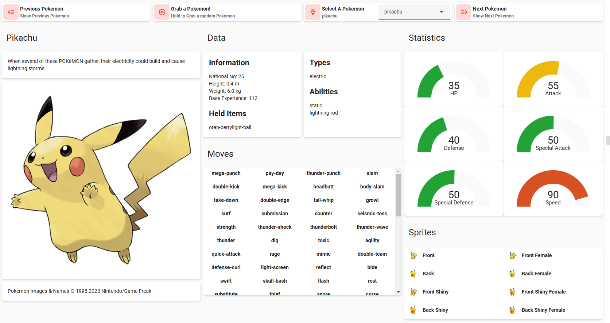
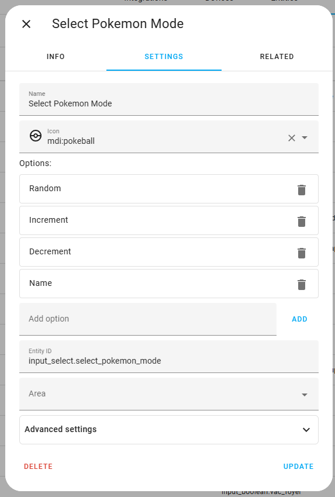

# Ramdom Pokemon Home Assistant Interface 

What started as a simple question in Home Assistant Forums led me to create this interface. 
Fun for the kids (and adults too) and was a great learning experience.
For more information and great background information, take a look here: [Daily Random Pokemon](https://community.home-assistant.io/t/daily-random-pokemon/529978/2)

## Final Result

I always like to give you a glance at what you are building first. 
This helps you to understand the components and what goes into the solution. 
What we are building is shown here:



There are several components in this interface.
Across the top, you can navigate to previous and next Pokemon based on the National ID.
You can "roll the dice" and grab a random pokemon whose ID ranges from 1 to 1008.
You can even select a specific Pokemon by name.

The data is all extracted from the [Restful Pokemon API](https://pokeapi.co/) into a few different sensors.

## Prerequisites

As for the GUI, there are of course some standard cards like horizontal-stack and vertical-stack. But there are also several custom cards used. These include:

- [Mushroom](https://github.com/piitaya/lovelace-mushroom)
- [Stack-in Card](https://github.com/custom-cards/stack-in-card)
- [State Switch](https://github.com/thomasloven/lovelace-state-switch)
- [Gauge](https://github.com/custom-cards/gauge-card)
- [Auto Entities](https://github.com/thomasloven/lovelace-auto-entities)
- [Config Template](https://github.com/iantrich/config-template-card)
- [Card Templater](https://github.com/gadgetchnnel/lovelace-card-templater)

If you want the solution to work as is, you will need to be sure you have these installed and working in your Lovelace configuration.

## Sensors

There are several sensors. One is used for the majority of the data for a specific Pokemon.
I chose to call this one sensor.random_pokemon and it is defined in my included sensor.yaml as:

```
##
## Random Pokemon
## 
- platform: rest
  name: Random Pokemon
  scan_interval: 360000
  resource_template: >
      
        https://pokeapi.co/api/v2/pokemon/{{ state_attr('sensor.random_pokemon','id') + 1 }}
      
        https://pokeapi.co/api/v2/pokemon/{{ state_attr('sensor.random_pokemon','id') - 1 }}
      
        https://pokeapi.co/api/v2/pokemon/{{ states('input_select.pokedex') }}
      
        https://pokeapi.co/api/v2/pokemon/{{ range(1, 1008) | random }}
      
  value_template: "{{ now() }}"
  json_attributes:
    - abilities
    - base_experience
    - forms
    - game_indicies
    - height
    - held_items
    - id
    - is_default
    - location_area_encounters
    - moves
    - name
    - order
    - past_types
    - species
    - sprites
    - stats
    - types
    - weight
```

A second sensor is used for text descriptions as they are not maintained in the main REST call JSON that is returned.
Instead, the main JSON has links to the text in many languages. 
There is also additional information in this JSON that can be used.
I choose to call this sesnor.pokemon_species:

```
- platform: rest
  name: Pokemon Species
  scan_interval: 360000
  resource_template: "{{ state_attr('sensor.random_pokemon','species').url }}"
  value_template: "{{ now() }}"
  json_attributes:
    - base_happiness
    - capture_rate
    - color
    - egg_groups
    - evolution_chain
    - evolves_from_species
    - flavor_text_entries
    - form_descriptions
    - forms_switchable
    - gender_rate
    - genera
    - generation
    - growth_rate
    - habitat
    - has_gender_differences
    - hatch_counter
    - id
    - is_baby
    - is_legendary
    - is_mythical
    - name
    - shape
    - varieties
    - names
    - order
```

The third sensor is a template that contains the entire set of Pokemon names used to populate the input_select.
I choose to call this sensor.pokedex:

```
- platform: rest
  name: Pokedex
  scan_interval: 360000
  resource_template: https://pokeapi.co/api/v2/pokemon/?limit=1008
  value_template: "{{ now() }}"
  json_attributes:
    - results
```

You would note on the above sensors, the scan_interval is set really high. 
I do this because it is better to use an automation to trigger an update to the sensor so you can control the throttling.

Lastly, while it is not needed really but made this easier for the charting of the statistics, I created a template sensor the isolates only the stats.
That is called sesnor.pokemo_base_stats. The key here is that it's state is the maximum value of any one stat so as to calculate the relative value of them all.

```
###
### Pokemon Base Stats
###
  - name: Pokemon Base Stats
    state: '{{ state_attr("sensor.random_pokemon","stats") | map(attribute="base_stat") | max }}'
    attributes:
        hp: '{{ state_attr("sensor.random_pokemon","stats")[0].base_stat }}'
        attack: '{{ state_attr("sensor.random_pokemon","stats")[1].base_stat }}'
        defense: '{{ state_attr("sensor.random_pokemon","stats")[2].base_stat }}'
        special-attack: '{{ state_attr("sensor.random_pokemon","stats")[3].base_stat }}'
        special-defense: '{{ state_attr("sensor.random_pokemon","stats")[4].base_stat }}'
        speed: '{{ state_attr("sensor.random_pokemon","stats")[5].base_stat }}'
```
## Input Selects

There are two input selects created for this (one visible and one not). 
The first one is the one that contains all 1008 Pokemon names.
The second one merely sets the "mode" of the selection (Randon, Increment, Decrement, Name).
I believe this could be removed but I set it up this way to test and just left it.

You could just use a helper to create them, but as an example here is YAML in an include for input_select to set up the names.
It is obviously called input_select.pokedex.

```
#############################
######### pokedex ###########
#############################
pokedex:
    options:
        - bulbasaur
```

You would note that it is empty. This is because the options will be populated by an automation at home assistant startup.
We'll see this in the next section for automations.

The other input_select was created with a helper and only serves to know what the mode is for grabbing a Pokemon. The helper looks like this:



## Automations and Scripts

This first one is an Automation, it would basically re-populate the "options" in the input_select.pokedex with the data 
from the sensor.pokedex:

```
alias: Build Pokedex Options
description: ""
trigger:
  - platform: homeassistant
    event: start
condition: []
action:
  - service: input_select.set_options
    data_template:
      entity_id: input_select.pokedex
      options: |-
        
           
            
          
        {{ pdex.poke | list }}
mode: single
```
The only one is a Script. This script would be called when one of the modes is chosen (Random, Increment, Decrement, Name).
The script takes in the mode and updates the main sensor.random_pokemon based on that mode.

```
alias: Get Pokemon
variables:
  pokemode: Increment
sequence:
  - service: input_select.select_option
    data:
      option: "{{ pokemode }}"
    target:
      entity_id: input_select.select_pokemon_mode
  - service: homeassistant.update_entity
    data: {}
    target:
      entity_id: sensor.random_pokemon
  - service: homeassistant.update_entity
    data: {}
    target:
      entity_id: sensor.pokemon_species
  - service: input_select.select_option
    data:
      option: Random
    target:
      entity_id: input_select.select_pokemon_mode
  - service: input_select.select_option
    data:
      option: "{{state_attr('sensor.random_pokemon','name') }}"
    target:
      entity_id: input_select.pokedex
mode: single
```

## The GUI

The remaining stuff is the GUI. We have sensors with lots of data we can use.

NOTE: In this example code you will see that I have all the images stored locally on my Home Assistant server and I am not grabbing them from the web.
YOu can choose to do as you wish but in theory, one Pokemon could have 1 main image and 8 sprites with images that never change.
I chose to download and I am not posting them here, but I can provide to anyone requested them.

```
type: vertical-stack
cards:
  - type: horizontal-stack
    cards:
      - type: custom:mushroom-template-card
        entity: sensor.random_pokemon
        primary: Previous Pokemon
        secondary: Show Previous Pokemon
        icon: mdi:backburger
        icon_color: red
        tap_action:
          action: none
        hold_action:
          action: call-service
          service: script.get_pokemon
          data:
            pokemode: Decrement
          target: {}
      - type: custom:mushroom-template-card
        entity: sensor.random_pokemon
        primary: Grab a Pokemon!
        secondary: Hold to Grab a random Pokemon
        icon: mdi:pokeball
        icon_color: red
        tap_action:
          action: none
        hold_action:
          action: call-service
          service: script.get_pokemon
          data:
            pokemode: Random
          target: {}
      - type: custom:mushroom-select-card
        entity: input_select.pokedex
        icon: mdi:pokemon-go
        icon_color: red
        name: Select A Pokemon
        layout: horizontal
        hold_action:
          action: call-service
          service: script.get_pokemon
          data:
            pokemode: Name
          target: {}
      - type: custom:mushroom-template-card
        entity: sensor.random_pokemon
        primary: Next Pokemon
        secondary: Show Next Pokemon
        icon: mdi:forwardburger
        icon_color: red
        tap_action:
          action: none
        hold_action:
          action: call-service
          service: script.get_pokemon
          data:
            pokemode: Increment
          target: {}
  - type: horizontal-stack
    cards:
      - type: vertical-stack
        cards:
          - type: custom:mushroom-title-card
            entity: sensor.random_pokemon
            title: '{{state_attr(''sensor.random_pokemon'',''name'') | capitalize}}'
            subtitle: ''
            title_tap_action:
              action: none
          - type: markdown
            content: >
                
                  
                {{ fv.engfv[0] }}
          - type: custom:config-template-card
            entities:
              - sensor.random_pokemon
            card:
              type: picture-entity
              entity: sensor.random_pokemon
              show_name: false
              show_state: false
              image: >-
                ${'http://192.168.2.245:8123/local/Pokemon/Sprites/Master/' +
                states['sensor.random_pokemon'].attributes.id + '.png'}


          - type: markdown
            content: |
              Pokémon Images &amp; Names &copy; 1995-2023 Nintendo/Game Freak.
      - type: vertical-stack
        cards:
          - type: custom:mushroom-title-card
            title: Data
            subtitle: ''
            title_tap_action:
              action: none
          - type: horizontal-stack
            cards:
              - type: markdown
                content: >-
                  ## Information

                  National No: {{state_attr('sensor.random_pokemon','id') }}

                  Height: {{state_attr('sensor.random_pokemon','height')/10}} m

                  Weight: {{state_attr('sensor.random_pokemon','weight')/10 }}
                  kg

                  Base Experience:
                  {{state_attr('sensor.random_pokemon','base_experience') }}

                  ## Held Items

                   
                    {{ hi.item.name }}
                   
                    {{'No Held Items'}}
                  
              - type: markdown
                content: >-
                  ## Types

                  
                    {{ tp.type.name }}
                  

                  ## Abilities

                  
                    {{ ab.ability.name }}
                  
          - type: custom:mushroom-title-card
            title: Moves
            subtitle: ''
            title_tap_action:
              action: none
          - type: custom:stack-in-card
            mode: vertical
            style: 'ha-card {overflow-y: scroll!important; height: 350px}'
            cards:
              - type: custom:auto-entities
                card:
                  type: grid
                  square: false
                  columns: 4
                card_param: cards
                filter:
                  template: |-
                    
                      {{
                        {
                          'type': 'custom:mushroom-template-card',
                          'primary': mv.move.name,
                          'secondary': '',
                          'icon_type': 'none',
                          'tap_action': 'none',
                          'style': 'ha-card {text-align: center; box-shadow: none}'
                        }
                       }},
                     
      - type: vertical-stack
        cards:
          - type: custom:mushroom-title-card
            title: Statistics
            subtitle: ''
            title_tap_action:
              action: none
          - type: custom:stack-in-card
            mode: vertical
            cards:
              - type: horizontal-stack
                cards:
                  - type: custom:card-templater
                    entities:
                      - sensor.random_pokemon
                    card:
                      type: custom:gauge-card
                      entity: sensor.pokemon_base_stats
                      attribute: hp
                      measurement: ''
                      title: HP
                      min: 0
                      max_template: >-
                        {{ (state_attr("sensor.random_pokemon","stats") |
                        map(attribute="base_stat") | max) * 1.1 }}
                      severity:
                        red_template: >-
                          {{ (state_attr("sensor.random_pokemon","stats") |
                          map(attribute="base_stat") | max) * 0.8 }}
                        green_template: >-
                          {{ (state_attr("sensor.random_pokemon","stats") |
                          map(attribute="base_stat") | max) * 0.3 }}
                        amber_template: >-
                          {{ (state_attr("sensor.random_pokemon","stats") |
                          map(attribute="base_stat") | max) * 0.6 }}
                  - type: custom:card-templater
                    entities:
                      - sensor.random_pokemon
                    card:
                      type: custom:gauge-card
                      entity: sensor.pokemon_base_stats
                      attribute: attack
                      measurement: ''
                      title: Attack
                      min: 0
                      max_template: >-
                        {{ (state_attr("sensor.random_pokemon","stats") |
                        map(attribute="base_stat") | max) * 1.1 }}
                      severity:
                        red_template: >-
                          {{ (state_attr("sensor.random_pokemon","stats") |
                          map(attribute="base_stat") | max) * 0.8 }}
                        green_template: >-
                          {{ (state_attr("sensor.random_pokemon","stats") |
                          map(attribute="base_stat") | max) * 0.3 }}
                        amber_template: >-
                          {{ (state_attr("sensor.random_pokemon","stats") |
                          map(attribute="base_stat") | max) * 0.6 }}
              - type: horizontal-stack
                cards:
                  - type: custom:card-templater
                    entities:
                      - sensor.random_pokemon
                    card:
                      type: custom:gauge-card
                      entity: sensor.pokemon_base_stats
                      attribute: defense
                      measurement: ''
                      title: Defense
                      min: 0
                      max_template: >-
                        {{ (state_attr("sensor.random_pokemon","stats") |
                        map(attribute="base_stat") | max) * 1.1 }}
                      severity:
                        red_template: >-
                          {{ (state_attr("sensor.random_pokemon","stats") |
                          map(attribute="base_stat") | max) * 0.8 }}
                        green_template: >-
                          {{ (state_attr("sensor.random_pokemon","stats") |
                          map(attribute="base_stat") | max) * 0.3 }}
                        amber_template: >-
                          {{ (state_attr("sensor.random_pokemon","stats") |
                          map(attribute="base_stat") | max) * 0.6 }}
                  - type: custom:card-templater
                    entities:
                      - sensor.random_pokemon
                    card:
                      type: custom:gauge-card
                      entity: sensor.pokemon_base_stats
                      attribute: special-attack
                      measurement: ''
                      title: Special Attack
                      min: 0
                      max_template: >-
                        {{ (state_attr("sensor.random_pokemon","stats") |
                        map(attribute="base_stat") | max) * 1.1 }}
                      severity:
                        red_template: >-
                          {{ (state_attr("sensor.random_pokemon","stats") |
                          map(attribute="base_stat") | max) * 0.8 }}
                        green_template: >-
                          {{ (state_attr("sensor.random_pokemon","stats") |
                          map(attribute="base_stat") | max) * 0.3 }}
                        amber_template: >-
                          {{ (state_attr("sensor.random_pokemon","stats") |
                          map(attribute="base_stat") | max) * 0.6 }}
              - type: horizontal-stack
                cards:
                  - type: custom:card-templater
                    entities:
                      - sensor.random_pokemon
                    card:
                      type: custom:gauge-card
                      entity: sensor.pokemon_base_stats
                      attribute: special-defense
                      measurement: ''
                      title: Special Defense
                      min: 0
                      max_template: >-
                        {{ (state_attr("sensor.random_pokemon","stats") |
                        map(attribute="base_stat") | max) * 1.1 }}
                      severity:
                        red_template: >-
                          {{ (state_attr("sensor.random_pokemon","stats") |
                          map(attribute="base_stat") | max) * 0.8 }}
                        green_template: >-
                          {{ (state_attr("sensor.random_pokemon","stats") |
                          map(attribute="base_stat") | max) * 0.3 }}
                        amber_template: >-
                          {{ (state_attr("sensor.random_pokemon","stats") |
                          map(attribute="base_stat") | max) * 0.6 }}
                  - type: custom:card-templater
                    entities:
                      - sensor.random_pokemon
                    card:
                      type: custom:gauge-card
                      entity: sensor.pokemon_base_stats
                      attribute: speed
                      measurement: ''
                      title: Speed
                      min: 0
                      max_template: >-
                        {{ (state_attr("sensor.random_pokemon","stats") |
                        map(attribute="base_stat") | max) * 1.1 }}
                      severity:
                        red_template: >-
                          {{ (state_attr("sensor.random_pokemon","stats") |
                          map(attribute="base_stat") | max) * 0.8 }}
                        green_template: >-
                          {{ (state_attr("sensor.random_pokemon","stats") |
                          map(attribute="base_stat") | max) * 0.3 }}
                        amber_template: >-
                          {{ (state_attr("sensor.random_pokemon","stats") |
                          map(attribute="base_stat") | max) * 0.6 }}
          - type: custom:mushroom-title-card
            title: Sprites
            subtitle: ''
            title_tap_action:
              action: none
          - type: vertical-stack
            cards:
              - type: custom:stack-in-card
                mode: vertical
                cards:
                  - type: horizontal-stack
                    cards:
                      - type: vertical-stack
                        cards:
                          - type: custom:mushroom-template-card
                            picture: >
                              /local/Pokemon/Sprites/front/{{state_attr('sensor.random_pokemon','id')}}.png
                            primary: Front
                            secondary: ''
                            layout: horizontal
                            tap_action:
                              action: none
                            hold_action:
                              action: none
                            double_tap_action:
                              action: none
                          - type: custom:mushroom-template-card
                            picture: >
                              /local/Pokemon/Sprites/back/{{state_attr('sensor.random_pokemon','id')}}.png
                            primary: Back
                            secondary: ''
                            layout: horizontal
                            tap_action:
                              action: none
                            hold_action:
                              action: none
                            double_tap_action:
                              action: none
                          - type: custom:mushroom-template-card
                            picture: >
                              /local/Pokemon/Sprites/front/shiny/{{state_attr('sensor.random_pokemon','id')}}.png
                            primary: Front Shiny
                            secondary: ''
                            layout: horizontal
                            tap_action:
                              action: none
                            hold_action:
                              action: none
                            double_tap_action:
                              action: none
                          - type: custom:mushroom-template-card
                            picture: >
                              /local/Pokemon/Sprites/back/shiny/{{state_attr('sensor.random_pokemon','id')}}.png
                            primary: Back Shiny
                            secondary: ''
                            layout: horizontal
                            tap_action:
                              action: none
                            hold_action:
                              action: none
                            double_tap_action:
                              action: none
                      - type: vertical-stack
                        cards:
                          - type: custom:mushroom-template-card
                            picture: >
                              
                                /local/Pokemon/Sprites/front/female/{{state_attr("sensor.random_pokemon","id")}}.png
                              
                                /local/Pokemon/Sprites/0.png
                              
                            primary: Front Female
                            secondary: ''
                            layout: horizontal
                            tap_action:
                              action: none
                            hold_action:
                              action: none
                            double_tap_action:
                              action: none
                          - type: custom:mushroom-template-card
                            picture: >
                              
                                /local/Pokemon/Sprites/back/female/{{state_attr("sensor.random_pokemon","id")}}.png
                              
                                /local/Pokemon/Sprites/0.png
                              
                            primary: Back Female
                            secondary: ''
                            layout: horizontal
                            tap_action:
                              action: none
                            hold_action:
                              action: none
                            double_tap_action:
                              action: none
                          - type: custom:mushroom-template-card
                            picture: >
                              
                                /local/Pokemon/Sprites/back/female/shiny/{{state_attr("sensor.random_pokemon","id")}}.png
                              
                                /local/Pokemon/Sprites/0.png
                              
                            primary: Front Shiny Female
                            secondary: ''
                            layout: horizontal
                            tap_action:
                              action: none
                            hold_action:
                              action: none
                            double_tap_action:
                              action: none
                          - type: custom:mushroom-template-card
                            picture: >
                              
                                /local/Pokemon/Sprites/back/female/shiny/{{state_attr("sensor.random_pokemon","id")}}.png
                              
                                /local/Pokemon/Sprites/0.png
                              
                            primary: Back Shiny Female
                            secondary: ''
                            layout: horizontal
                            tap_action:
                              action: none
                            hold_action:
                              action: none
                            double_tap_action:
                              action: none
```


